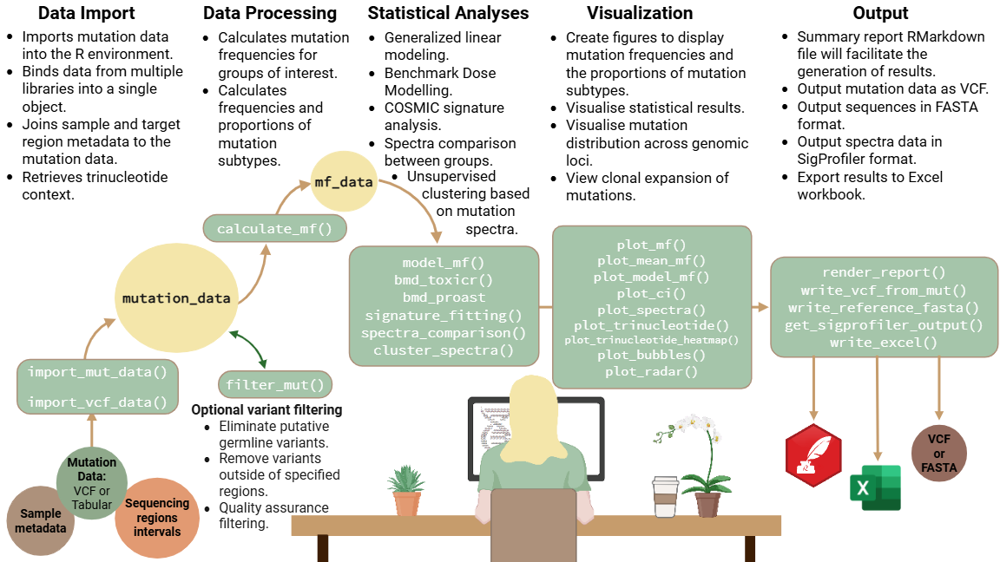

# MutSeqR <a href="https://ehsrb-bsrse-bioinformatics.github.io/MutSeqR/"></a>

<!-- badges: start -->

[](https://github.com/EHSRB-BSRSE-Bioinformatics/MutSeqR/actions/workflows/R-CMD-check.yaml)
[](LICENSE)

<!-- badges: end -->

> [!IMPORTANT]

> This version of MutSeqR is built for Bioconductor version Development (v3.23) and R v4.6.0. This is the first Bioconductor release. If you cannot install the Development version, or are using an older version of R, please use the [working_version](https://github.com/EHSRB-BSRSE-Bioinformatics/MutSeqR/tree/working_version) branch on GitHub.

## Overview

MutSeqR is an open-source R package to analyze error-corrected Next-Generation
Sequencing (ECS) data, empowering users with flexibility during exploratory analyses while ensuring compatibility across technologies.



<details>
<summary><strong>
Figure transcript
</strong></summary>
<em>1. Data Import: Imports mutation data into the R environment. Binds data from multiple libraries into a single object. Joins sample and target region metadata to the mutation data. Retrieves trinucleotide context. 2. Data Processing: Calculates mutation frequencies for groups of interest. Calculates frequencies and proportions of mutation subtypes. Optional Variant filtering: eliminates putative germline variants, removes variants outside of specified regions, quality assurance filtering. 3. Statistical Analyses: Generalized linear modeling. Benchmark Dose Modeling. COSMIC signature analysis. Spectra comparison between groups. Unsupervised clustering based on mutation spectra. 4. Visualization: Create figures to display mutation frequencies and the proportions of mutation subtypes. Visualise statistical results. Visualise mutation distribution across genomic loci. View clonal expansion of mutations. 5. Output: Summary report RMarkdown file will faciliatte the generation of results. Output mutation data as VCF. Output sequences in FASTA format. Output spectra data in SigProfiler format. Export results to  Excel workbook.
</em>
</details>

## Vignette

See the [vignette](https://ehsrb-bsrse-bioinformatics.github.io/MutSeqR/articles/MutSeqR_introduction.html#introduction) for details on function utility.

## Changelog

See the [release notes on the pkgdown site](https://ehsrb-bsrse-bioinformatics.github.io/MutSeqR/news/index.html)
for version history.

You can also view [GitHub releases](https://github.com/EHSRB-BSRSE-Bioinformatics/MutSeqR/releases).

## Installation

To install this package, start R (version "4.6") and enter:

```{r, eval = FALSE}
if (!require("BiocManager", quietly = TRUE))
    install.packages("BiocManager")

# The following initializes usage of Bioc devel
BiocManager::install(version='devel')

BiocManager::install("MutSeqR")
```

## Examples

Example data is loaded through BioConductor ExperimentHub data package.

```{r, eval = FALSE}
BiocManager::install("ExperimentHub")

library(ExperimentHub)

# Create an index
eh <- ExperimentHub()
query(eh, "MutSeqRData")
```

Access example data through the index:

```{r, eval = FALSE}
example_data <- eh[["EH9857"]]
```

## Getting Help

If you encounter a clear bug, please file an issue with a minimal reproducible example on [Github](https://github.com/EHSRB-BSRSE-Bioinformatics/MutSeqR/issues).

## Citation

To cite this package in publications use:

Annette E Dodge, Andrew Williams, Danielle P M LeBlanc, David M Schuster, Elena Esina, Charles C Valentine, Jesse J Salk, Alex Y Maslov, Chris Bradley, Carole L Yauk, Francesco Marchetti, Matthew J Meier, MutSeqR: an open source R package for standardized analysis of error-corrected next-generation sequencing data in genetic toxicology, Bioinformatics Advances, Volume 5, Issue 1, 2025, vbaf265, https://doi.org/10.1093/bioadv/vbaf265
